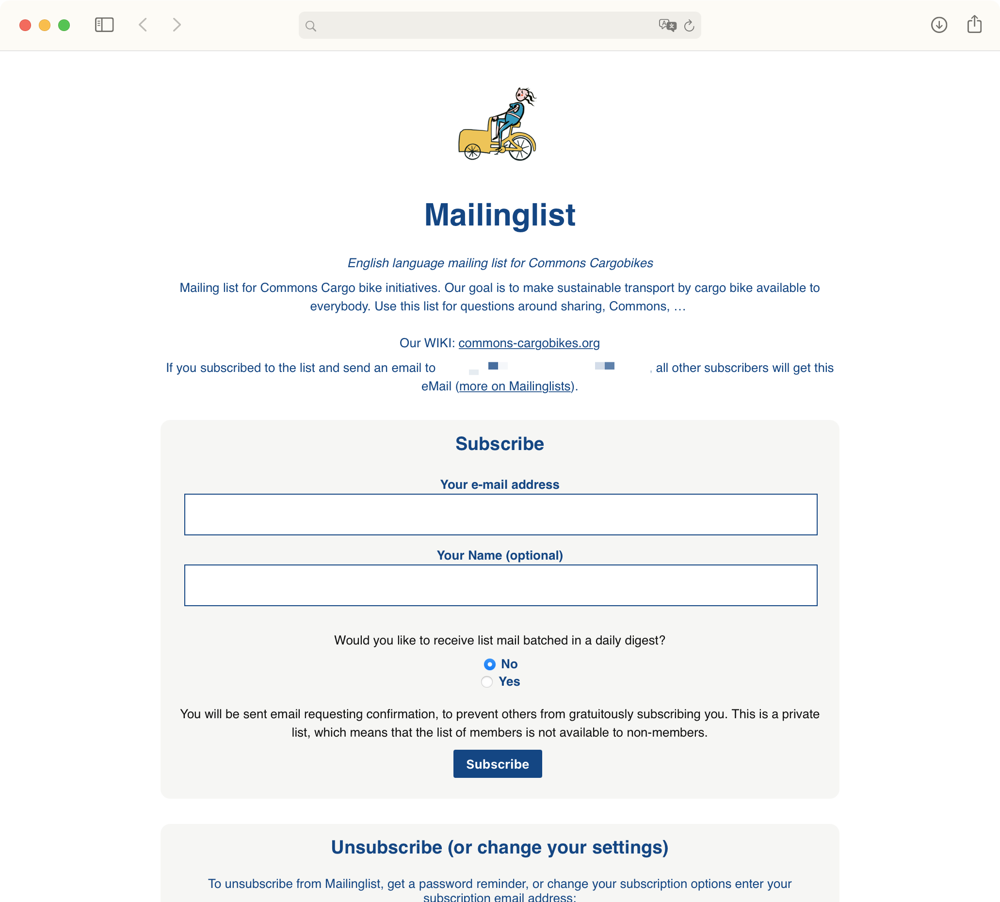
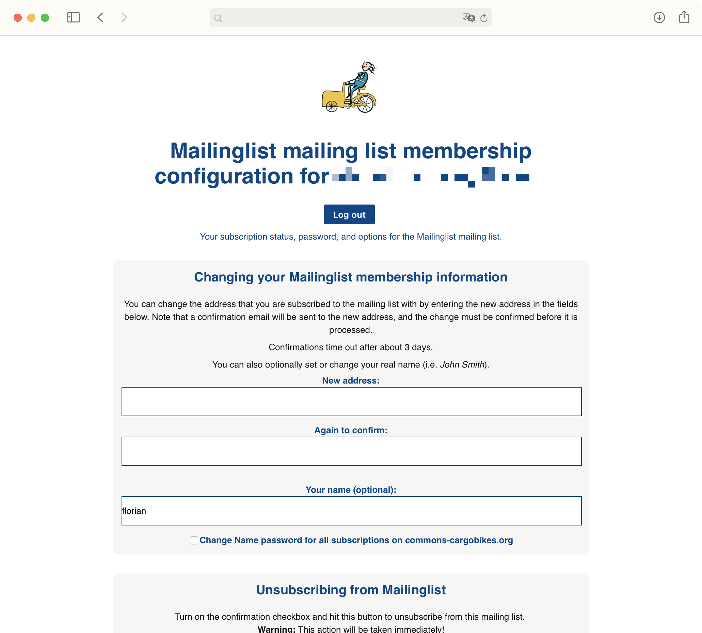
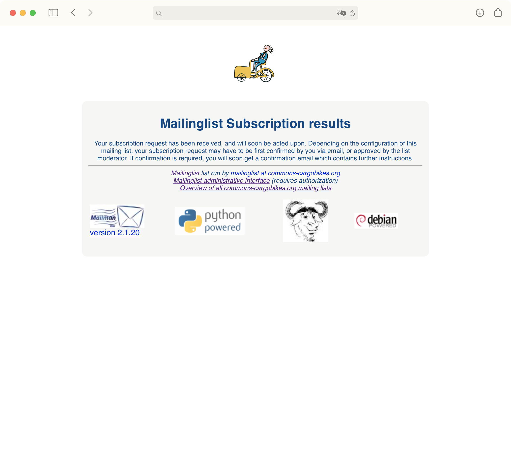

Mailman templates
==================

* General list information page 
* User specific options page
* Subscription results page

---

## Screenshots

Illustration by (Kerstin Unger)[http://kerstinunger.com].

---

## How To:

Go to your Mailinglist’s administrative Interface; Click "Edit the public HTML pages and text files" (right, above "Logout"); 

1. General Informations

	* Click "General list information page"
	* Copy + paste the content of `generalListInformationPage.html` in the form field.

2. User Specific Information

	* Click "User specific options page"
	* Copy + paste the content of `userSpecificPageOptions.html` in the form field.
	
3. Subscription results

	* Click "Subscribe results page"
	* Copy + paste the content of `subscribe.html` in the form field.

## Licenses
* For `generalListInformationPage.html`: Creative Commons 4.0 BY 
* For `userSpecificPageOptions.html` & `subscribe.hmtl` GPL 2 (since it’s text is taken from the original form from Mailman)

